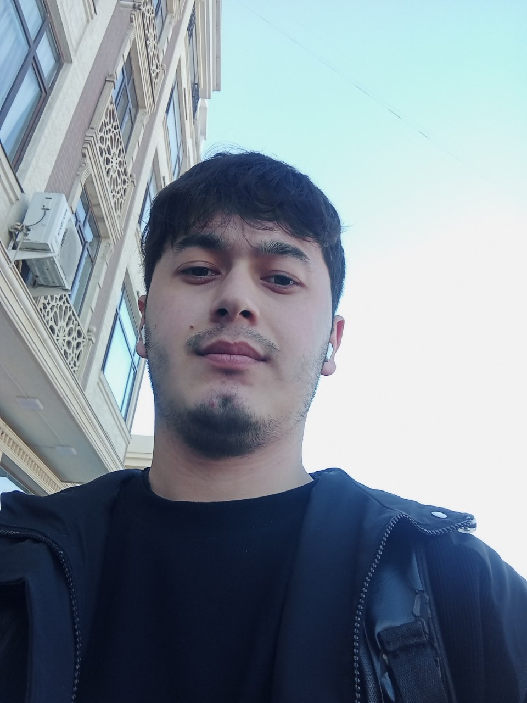

<h1 align="center">Portfolio</h1>

<table>
  <tr>
    <td width="220">
      
    </td>
    <td>
      <h2>👋 About Me</h2>
      

        My name is Doston Abdug'apporov.  
        I am a backend developer, constantly improving my skills.  
        I work with Python, Django, DRF, Docker, and other technologies.  
        My goal is continuous learning and contributing to modern projects. 
      

    </td>
  </tr>
</table>

---

## 🚀 Projects
- [StreetSport](https://github.com/DostonAbdugafforov/streetsport) – Stadionlarni bron qilish tizimi  
- [ERP System](https://github.com/DostonAbdugafforov/erp-system) – Ombor boshqaruv tizimi  
- [Portfolio Website](https://github.com/DostonAbdugafforov/portfolio) – Shaxsiy portfolio loyiham  

---

## 📫 Contact
- 📧 Email: abdugafforovdoston626@gmail.com 
- 📱 Phone: +998 90 877 60 41  
- 🌍 Location: Tashkent, Uzbekistan  
